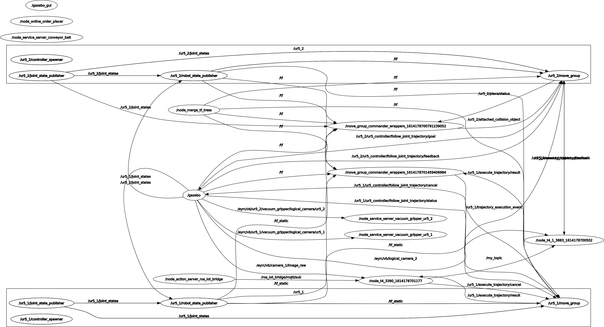

.. Vargi bots #0865 documentation master file, created by
   sphinx-quickstart on Fri Feb 12 19:28:43 2021.
   You can adapt this file completely to your liking, but it should at least
   contain the root `toctree` directive.

Welcome to Vargi bots #0865's documentation!
============================================

.. image:: index.png
   :height: 200px
   :width: 400px

**Introduction:**
============================================
**Summary:** In this task of Vargi bots, we collected the order through mqqt and placed the pakages on the conveyer belt according to the priority of Medical, Food, Clothes in increasing order.
After the packages were placed on the conveyer belt, the corresponding google spreadsheet would be updated and an email of *dispatched package* would be sent. 
And the other UR5_Arm would sort the packages according to their color and place them in their respective bin and further update the spreadsheet and send an email of *shipment of package*.

**Video**:

`Video link for the task <https://www.youtube.com/watch?v=Ih47al4Peu0>`_

**Implementation:**
============================================
The task5 of vargi bots includes three main sections, that we divided into to work on simaltaneously and has an distributed workflow, they are as following:

* *Getting the orders from MQQT :* In this section, we use node_online_order_placer.py file from the  	vb_sim package given by the eyantra team. This node publishes the message file to the topic 
  */eyrc/vb/aBCaRvEc/orders*. The corresponding message is subscribed by the nodes in the task5 and 
  thus getting the incoming orders from the MQTT. The subsequent order_id and other parameters 	      	related to the order are also pushed on the google spreadsheet. 

* *Priority based pick and place of packages and upadating spreadsheet :*  In this section, we        	have implemented priority based picking and placing of objects through the help of an list, which   	is appended whenever an order is recieved on the IncomingOrders spreadsheet, this list is then      	sorted lexicographically in decreasing order to have *Medicine* at the front of the list, whenever  	it is recieved, *Food* in the next order and *Clothes* are served last, according to given 	      	priority. 

  Then 	the color is decoded using camera and is stored in a global dictionary, which contains the    	name of the package as key and its color as value. By the use of this dictionary we find the        	package no. of required package and get the joint angles for picking up the respective       	      	packages. An extensive error handling capability has also been included in case if any set joint    	angles failed, which involves returning to the home pose of the arm and then trying to reach the    	position from the home pose.
  
  After the package is picked up the next move was to move the package to a position where it can 
  drop the package above the conveyer belt. The joint angles have been manually noted from the rviz   	and the have been passed to set joint angles value. As soon the package is detached from the ur5_1  	arm, we update the google spreadsheet for DispatchedOrders and send an email to the client using an 	automatic python script and google script editor. 

* *Sorting of the packages and updating the spreadsheet:* In this section we sort the 	      	      	incoming packages on the conveyer belt by subscribing to the message sent by the logical camera 2   	publisher and based on the color input we get we go to predefined poses, again by using set joint   	angles function and then detach the package when the arm is positioned above the bin of the color   	of the package. When the package is detached the corresponding *spreadsheet* is updated and email   	is sent to the customer alerting about the shipment of their package. This is done using the google 	script editor and python script, which automates the entire process.   
   
**RQTT Graph**:

===========================================

**API Documentation:**

============================================

**API documenation for pkg_task5**

**class pkg_sort:**
    """
    Class to pick the packages from the shelf and place on the conveyer belt
    """
*    def __init__(self):
        """
        Initialization of the class Object
        """
*    def callback(self,data):
        """
        Callback function called by the rospy subscriber to get the color of the box
        by using cv_bridge to convert ros_image to OpenCv image

        :type name: integer matrix
        :param name: contains the matrix of the image

        """
*    def pkg_color(self,arg_img):
        """
        Returns the package color based on the arg_img

        :type name: integer matrix
        :param name: decodes the image matrix to get the color of the box
        """
*    def vacuum_griper(self,state):
        """
        Activates the Vaccum Gripper

        :type name: string
        :param name: the state of the vaccum gripper i.e.. activated or deactivated
        """
*    def pkg_pose(self , joint_angles1 , joint_angles2):                                         
        """
        fethces the package from the shelf based on the input joint angles

        :type name: list for joint_angles1
        :param name: contains the joint angles in the form of the list

        :type name: list for joint angles2
        :param name: contains the joint angles in the form of the list
        """
*    def pkg_con_pose(self,con_joint_angles):
        """
        Function to make the ur5_1 above the conveyer belt to drop the package

        :type name(con_joint_angles): list
        :param name(con_joint_angles): Contains the joint angles for the arm to go above the conveyer 		belt
        """
*    def set_joint_angles(self, arg_list_joint_angles):
        """
        Function to set the joint angles of the arm to the values given
        as arguments

        :type name: list
        :param name: the numerical values for the joint angles to be set

        """
*    def go_to_predefined_pose(self, arg_pose_name):
        """
        Function to move the arm to one of the predifined poses

        :type name: string
        :param name: position name to which the arm must move to

        """
*    def inventory_push():
        """
        function to push the data into the inventory sheet
        """
*    def get_time_str():
        """
        function to get the timestamp when the object is picked
        """
*    def dispatched():
     	"""
     	function to update the dispatched google sheet when the package is kept on the conveyer belt
     	"""
*   def start(my_msg):
    	"""
    	function to start the simulation and updatation of the sheet when the order is recieved

    	:type name: list
    	:param name: contains the various parameters regarding the order
    	"""
*   def sheet(res1):
    	"""
    	function to update the IncomingOrders sheets based on the orders recieved from mqqt

    	:type name: list
    	:param name: contains the item name and order id for the order recieved
    	"""
*   def priority():
    	"""
    	function to server query of high priority packages first medium priority second
    	and low priority last when they orders are in a queue to be served
    	"""

**class sort:**
    """
    This class will sort the packages according to their colour

    """
*   def __init__(self):
        """
        creates the variables associated with the class

        """
*   def __del__(self):
        """
        Destructor
        To be called at the end of the instance

        """
*   def go_to_predefined_pose(self, arg_pose_name):
        """
        Function to move the arm to one of the predifined poses

        :type name: string
        :param name: position name to which the arm must move to

        """
*   def set_joint_angles(self, arg_list_joint_angles):
        """
        Function to set the joint angles of the arm to the values given
        as arguments

        :type name: list
        :param name: the numerical values for the joint angles to be set

        """
*   def callback(self,msg):
        """
        function which is called whenever a mesaage is recieved

        :type name : string
        :param name: message containing the positons of the box under the logical camera

        """
*   def get_time_str(self):
        """
        Get the timestamp of the time of starting
        """
*   def belt_stop(self):
        """
        Sort the packages based on the color detected by the logical_camera_2

        """
*   def pow_belt(self,power):
        """
        This function stops the conveyorBelt

        :type name: int
        :param name: specifies the operating power of the conveyer belt from range 11 to 100

        """
*   def vacuum_griper(self,state):
        """
        Activates the Vaccum Gripper

        :type name: string
        :param name: the state of the vaccum gripper i.e.. activated or deactivated

        """
*   def func_callback_topic_my_topic(self,myMsg):
        """
        Callback function for the subscriber ur5_2

        :type name: list
        :param name: contains the list of parameters to detect the package with the input coming from 		the logical_camera_2

        """
*   def shipped(self):
        """
        Function to send the shipped goods to the Google sheets
        """
*   def start(my_msg):
    	"""
    	Function to get the receive orders from google sheets through message file

    	:type name: string
    	:param name: contains the columns of the google sheet of the order recieved

    	"""

**API documentation for pkg_ros_iot_bridge**

**class IotRosBridgeActionServer:**
    """
    Class which acts as bridge between the IoT and ROS
    """
*   def __init__(self):
        """
        Initialization of the Action server
        """
*   def mqtt_sub_callback(self, client, userdata, message):
        """
        Callback function for subscriber to the mqqt

        :type name(message): list
        :param name(mesaage): It contains the information about the request sent
        to the mqqt and this message is broadcasted to the subscribers
        """
*   def on_goal(self, goal_handle):
        """
        Function called when the Action server recieves a goal

        :type(goal_handle): Encapsulates a state machine for a given goal that
         the user can trigger transisions on. All ROS interfaces for the goal
         are managed by the ActionServer to lessen the burden on the user
        """
*   def process_goal(self, goal_handle):
        """
        A thread to process the goal recieved by the action server

        :type(goal_handle): Encapsulates a state machine for a given goal that
         the user can trigger transisions on. All ROS interfaces for the goal
         are managed by the ActionServer to lessen the burden on the user
        """
*   def on_cancel(self, goal_handle):
        """
        Function to cancel the execution of the current goal when Cancel is
        recieved by the Action server

        :type(goal_handle): Encapsulates a state machine for a given goal that
         the user can trigger transisions on. All ROS interfaces for the goal
         are managed by the ActionServer to lessen the burden on the user
        """

.. toctree::
   :maxdepth: 2
   :caption: Contents:

   modules

